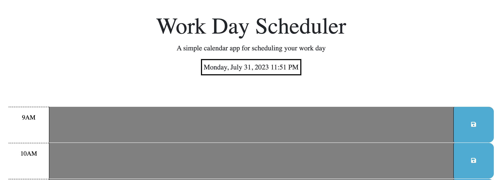

# <Work Day Scheduler Starter Code>>

## Description

The Daily Planner Application is a time management tool designed for busy employees to efficiently organize their schedules. It allows users to add important events to a daily planner and persistently saves the entered events using local storage. The application color-codes time blocks, indicating whether each block is in the past, present, or future, providing a clear visual representation of the day's timeline.

## Installation

Prerequisites:
To run the Daily Planner Application, you need the following prerequisites:

Web browser (e.g., Chrome, Firefox, Safari)
Internet connection (for initial loading and any online features)

## Usage

Open the Daily Planner Application in your web browser.
The current day will be displayed at the top of the calendar.
Scroll down to view time blocks for standard business hours (9 AM to 5 PM).
Each time block will be color-coded to indicate whether it is in the past, present, or future.
Click into a time block to enter an event for that specific hour.
After entering your event, click the "Save" button next to the time block to save the event to local storage.
If you refresh the page or close and reopen the application, the saved events will persist, allowing you to manage your daily schedule effectively

Deployment Link: https://rachelcodes42.github.io/dynamic-hourly-scheduler/

To add a screenshot, create an `assets/images` folder in your repository and upload your screenshot to it. Then, using the relative filepath, add it to your README using the following syntax:

    
    
  

## Credits

w3schools

## License

The Daily Planner Application is open-source software licensed under the MIT License. Feel free to use, modify, and distribute the application in accordance with the terms specified in the license.

## Badges

## Features

Display of the current day at the top of the calendar.
Time blocks for standard business hours (9 AM to 5 PM).
Color-coded time blocks to indicate past, present, and future events.
Ability to enter events for each time block.
Save events using local storage for persistence.
Responsive design for optimal usage on various devices.

HTML5
CSS3
JavaScript
Local Storage API

## How to Contribute

Contributions to the Daily Planner Application are welcome and encouraged! If you find any issues or have suggestions for improvements, please feel free to open an issue or submit a pull request on the project's GitHub repository.

